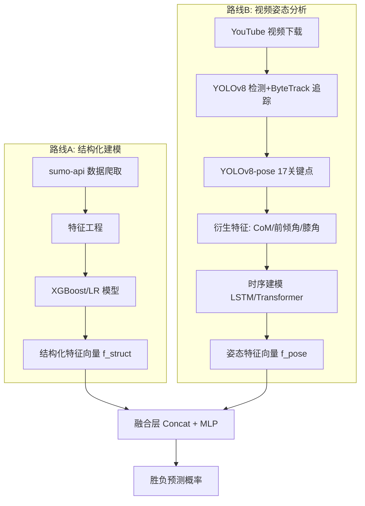
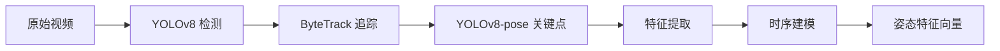
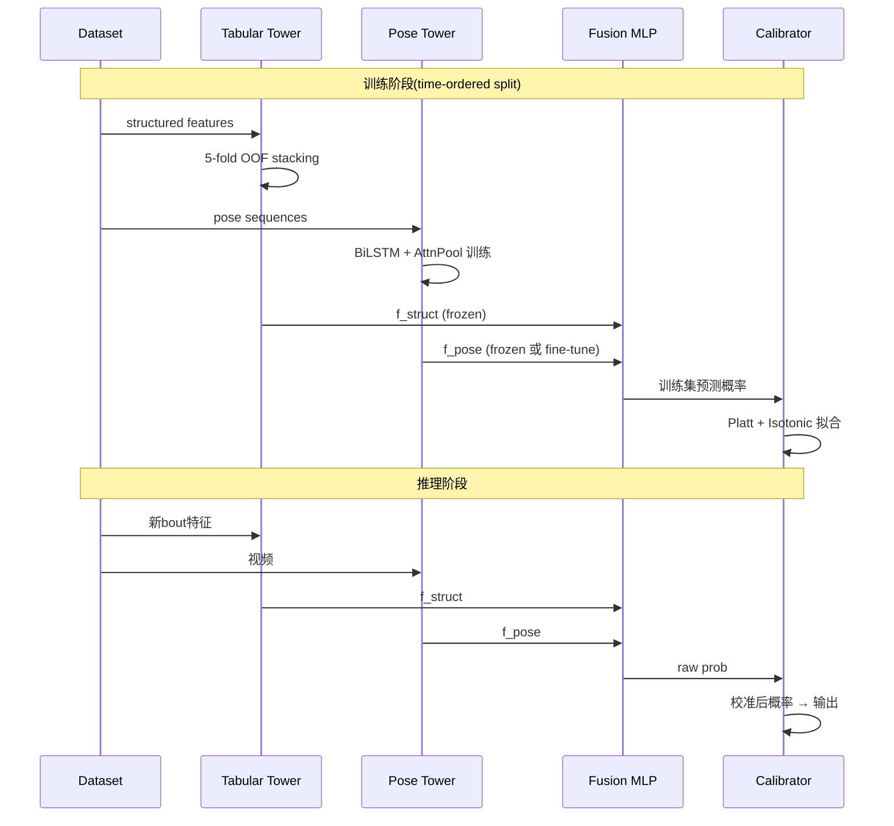

# 相扑胜负预测系统 / Sumo Bout Outcome Predictor / 大相撲勝敗予測システム

> **Repo**: `sumo-predictor` · **Python**: 3.11 · **Env**: conda `sumo_pred` · **Targets**: A路线 ≥61% · 融合 ≥65%

---

### English (Project description)

A sumo bout outcome prediction system combining **structured-data modeling** (career stats, banzuke rank, BMI, head-to-head) with **video pose analysis** (YOLOv8-pose + ByteTrack tracking, kinematic features like center-of-mass velocity, forward-lean angle, knee angles). Existing public baselines top out at ~61% accuracy using only structured features; we aim for **65%+** by fusing kinematic signals from video. The structured route (XGBoost + ensemble of LightGBM/CatBoost with target-encoding, Bayesian h2h shrinkage, time-decay weighting, and Platt-calibrated probabilities) is delivered first; the pose route adds an LSTM/Temporal-Transformer over per-frame skeletal features; finally a two-tower fusion MLP combines both.

### 日本語 (プロジェクト概要)

大相撲の取組勝敗を予測するシステム。**構造化データ路線**(過去戦績・身長体重・番付差・直接対戦履歴) と **映像姿勢解析路線**(YOLOv8-pose + ByteTrack による17関節点追跡、重心速度・前傾角・膝関節角といった力学特徴量) の二経路を組み合わせる。既存研究は構造化データのみで約61%が上限だが、本プロジェクトは映像由来の力学シグナルを融合することで **65%以上** を目標とする。第一段階で構造化路線(XGBoost + LightGBM/CatBoost のアンサンブル、ターゲットエンコーディング、ベイズ縮小による h2h 戦績の正則化、時間減衰重み、Platt スケーリング校正)を構築し、第二段階で時系列モデル(LSTM / Temporal Transformer)を姿勢特徴に適用、最終段階で双塔型 MLP により両者を融合する。

---

## 1. 项目概述 / Overview

构建一个相扑大相扑胜负预测系统，结合**结构化数据建模**与**视频姿态分析**两条路线，目标在现有研究 baseline(55–61%) 基础上做出增量。

### 1.1 目标

- **路线A(Baseline)**：用历史战绩、身高体重、排名差等结构化特征，复现并超越 61% 准确率
- **路线B(差异化)**：用 YOLOv8-pose + 动态轨迹特征，提取相扑专属的力学指标，作为增量特征
- **融合**：A+B 双塔模型，目标准确率 65%+

### 1.2 现有研究 baseline

| 项目 | 模型 | 特征 | 准确率 |
|---|---|---|---|
| chow-vincent/sumo_project | Logistic Regression | 历史战绩+排名 | ~61% |
| ElVejigante/Sumo-Tournament-Predictor | Logistic Regression | 身高/体重/年龄/排名差 | 55% |
| Josh Sulkers (Medium) | GaussianNB / LR / DT | 多特征组合 | ~55% |

**关键洞察**：现有研究**全部只用结构化特征**，没人做过视频姿态+轨迹分析。这是项目差异化所在。

---

## 2. 数据源

### 2.1 结构化数据

| 来源 | URL | 说明 |
|---|---|---|
| sumo-api.com | https://www.sumo-api.com/ | **首选**。完整API，1958年至今，含rikishi/basho/banzuke/torikumi/kimarite |
| sumostats.com | https://sumostats.com/ | banzuke、实时比赛、分析 |
| sumo-reference.com | https://sumodb.sumogames.de/ | 历史战绩详细记录 |
| Kaggle: Sumo Wrestling Matches | https://www.kaggle.com/datasets/thedevastator/sumo-wrestling-matches-results-1985-2019 | 1985-2019 比赛结果 |
| SCORE Sports | https://data.scorenetwork.org/wrestling/sumo_wrestingling_since_1957.html | 1957-2023 Makuuchi banzuke,15760行 |
| data.world | https://data.world/datasets/sumo | 5个相扑数据集 |

### 2.2 视频数据

| 来源 | 说明 |
|---|---|
| YouTube: SUMO PRIME TIME (官方) | 比赛精华,NHK解说 |
| YouTube: Don Don Sumo | 比赛集锦 |
| NHK World | 免费大相扑节目 |
| images.cv 相扑图像数据集 | 标注好的图像分类数据 |

### 2.3 没有的资源

- HuggingFace 上**没有**相扑专用视频/姿态数据集
- 没有公开的相扑动作标注数据(技巧名/kimarite)
- 视频+胜负的对齐数据需要自己构建

---

## 3. 系统架构



---

## 4. 路线A: 结构化建模

### 4.1 特征工程

#### 基础特征(力士A vs 力士B 的差值)

- `rank_diff`: 番付排名差
- `height_diff`: 身高差(cm)
- `weight_diff`: 体重差(kg)
- `bmi_diff`: BMI差
- `age_diff`: 年龄差

#### 历史战绩特征

- `winrate_A_recent_N`: 力士A最近N场胜率(N=10,30,90)
- `winrate_B_recent_N`: 力士B最近N场胜率
- `h2h_winrate`: 两人直接对战胜率(相性)
- `h2h_count`: 直接对战次数

#### 场所内状态

- `streak_A`: 当场所连胜/连败状态
- `streak_B`: 同上
- `current_record_A`: 当场所战绩(x勝y敗)
- `current_record_B`: 同上
- `day_of_basho`: 场所第几日(1-15)

#### 技巧偏好(kimarite)

- `pushing_ratio_A`: 押し相撲占比
- `pushing_ratio_B`: 同上
- `belt_ratio_A`: 四つ相撲(まわし)占比
- `belt_ratio_B`: 同上
- `kimarite_compatibility`: 技巧相性得分

#### 疲劳因子

- `days_since_last_bout`: 距上次比赛天数
- `total_bouts_this_basho`: 本场所累计比赛数

### 4.2 模型选择

| 模型 | 优点 | 缺点 |
|---|---|---|
| Logistic Regression | 可解释,基线 | 非线性能力弱 |
| XGBoost | 处理交互特征好,通常最强 | 调参成本 |
| CatBoost | 处理类别特征(stable,birthplace) | - |
| 简单MLP | 后续与路线B融合方便 | 数据量需求 |

**推荐**：先用 XGBoost 做主力，LR 做可解释性分析。

### 4.3 评估指标

- Accuracy(主指标)
- LogLoss(用于概率校准)
- AUC-ROC
- 按番付分层的准确率(横纲/大関/平幕)

---

## 5. 路线B: 视频姿态分析

### 5.1 Pipeline



### 5.2 关键点提取

使用 **YOLOv8-pose** (或 RTMPose 高精度版本)，提取COCO 17关键点：

| ID | 关键点 | ID | 关键点 |
|---|---|---|---|
| 0 | nose | 9 | left_wrist |
| 1 | left_eye | 10 | right_wrist |
| 2 | right_eye | 11 | left_hip |
| 3 | left_ear | 12 | right_hip |
| 4 | right_ear | 13 | left_knee |
| 5 | left_shoulder | 14 | right_knee |
| 6 | right_shoulder | 15 | left_ankle |
| 7 | left_elbow | 16 | right_ankle |
| 8 | right_elbow | | |

### 5.3 衍生特征

#### 单人静态特征(每帧)

| 特征 | 公式 | 物理意义 |
|---|---|---|
| 重心 CoM | (hip_L + hip_R) / 2 | 力学中心 |
| 重心高度 | hip_y / image_h | 越低越稳 |
| 前倾角 θ | arctan((shoulder_mid_x - hip_mid_x)/(hip_mid_y - shoulder_mid_y)) | 攻势强度 |
| 膝关节角 | angle(hip, knee, ankle) | 蹬地蓄力 |
| 步距宽度 | \|ankle_L_x - ankle_R_x\| | 支撑稳定性 |
| 躯干长度 | dist(shoulder_mid, hip_mid) | 用于归一化 |

#### 单人动态特征(时序窗口)

| 特征 | 公式 | 物理意义 |
|---|---|---|
| CoM 速度 | dCoM/dt | 移动快慢 |
| CoM 加速度 | d²CoM/dt² | 立合冲撞 |
| CoM 稳定性 | std(CoM, window=N) | 重心抖动 |
| 前倾角变化率 | dθ/dt | 攻防转换 |
| 手腕速度 | d(wrist)/dt | 推击/抓握动作 |

#### 双人交互特征

| 特征 | 公式 | 物理意义 |
|---|---|---|
| 双方CoM距离 | dist(CoM_A, CoM_B) | 对峙/接触状态 |
| 相对前倾角 | θ_A - θ_B | 谁更主动 |
| 推力方向 | (wrist_A - shoulder_A) · (CoM_B - CoM_A) | 推击效率 |
| 接触点估计 | min dist(wrist_A, body_B) | grip/push时机 |
| 优势侧 | sign(CoM_A_x - CoM_B_x) | 攻防态势 |

### 5.4 时序建模

```python
# 输入: 每帧约40维特征 × T帧序列
# 输出: 胜负概率

class SumoTemporalModel(nn.Module):
    def __init__(self, feat_dim=40, hidden=128):
        super().__init__()
        self.lstm = nn.LSTM(feat_dim, hidden, num_layers=2, 
                            batch_first=True, bidirectional=True)
        self.attn_pool = AttentionPooling(hidden*2)
        self.head = nn.Linear(hidden*2, 1)  # binary output
    
    def forward(self, x):  # x: (B, T, feat_dim)
        h, _ = self.lstm(x)
        pooled = self.attn_pool(h)
        return torch.sigmoid(self.head(pooled))
```

替代方案：Temporal Transformer(注意力机制更适合关键帧识别，如立合瞬间)。

### 5.5 技术难点与对策

| 难点 | 对策 |
|---|---|
| 两人重叠时关键点缺失 | Kalman filter插值 + 置信度加权 |
| 力士ID跨帧漂移 | ByteTrack + 土俵位置先验(左右力士) |
| 视角差异 | 土俵摄像机角度固定，做透视矫正→米级坐标 |
| 标注数据缺失 | 只标胜负(自动从结果获取)，跳过技巧分类 |
| 视频分辨率差异 | 用躯干长度归一化所有特征 |

---

## 6. 模型框架 / Model Framework

### 6.1 整体架构 (Two-Tower Fusion)

```mermaid
graph TB
    subgraph IN[输入]
        I1[bout context<br/>力士A/B IDs, basho, day]
    end

    subgraph TA[路线A 塔: Tabular Tower]
        TA1[特征工程<br/>rank/winrate/h2h/...]
        TA2[Target Encoding<br/>heya/shusshin]
        TA3[Bayesian Shrinkage<br/>稀疏h2h]
        TA4[XGBoost]
        TA5[LightGBM]
        TA6[CatBoost]
        TA7[Stacking Meta-LR]
        TA1 --> TA2 --> TA3
        TA3 --> TA4 & TA5 & TA6 --> TA7
        TA7 --> FA[f_struct ∈ ℝ^32]
    end

    subgraph TB_box[路线B 塔: Pose Tower]
        TB1[视频片段<br/>~5s 立合前后]
        TB2[YOLOv8-Pose<br/>17 keypoints/frame]
        TB3[ByteTrack<br/>双人ID锁定]
        TB4[Kinematic Features<br/>CoM/角度/速度/双人交互]
        TB5[Bi-LSTM × 2<br/>+ Attn Pooling]
        TB1 --> TB2 --> TB3 --> TB4 --> TB5
        TB5 --> FB[f_pose ∈ ℝ^128]
    end

    I1 --> TA1
    I1 --> TB1
    FA --> FUSION
    FB --> FUSION
    FUSION[Concat + MLP + Dropout] --> CAL[Platt/Isotonic 校准]
    CAL --> OUT[P(力士A 胜)]
```

### 6.2 路线A 塔 — Tabular Stack

| 层 | 组件 | 说明 |
|---|---|---|
| 输入 | ~40 维特征向量 | 见 §4.1 |
| 编码 | Target Encoding (KFold) | `heya`, `shusshin`, `kimarite_preferred` 等高基数类别 |
| 正则 | Bayesian Shrinkage | h2h 战绩稀疏时退化到先验(全局胜率) |
| 加权 | Time-Decay Sample Weight | 越早的 basho 权重越小: w = exp(-λ·Δbasho), λ≈0.05 |
| 基模型 | XGBoost / LightGBM / CatBoost | 三模型独立训练,不同种子/不同特征子集增加多样性 |
| 元学习器 | Logistic Regression (5-fold OOF stacking) | 输入是三个基模型的 OOF 概率 |
| 输出 | 32 维 logit + 概率 → `f_struct` | 直接做预测或送入融合层 |

### 6.3 路线B 塔 — Pose Stack

```python
class PoseTower(nn.Module):
    """
    输入: (B, T, 40)  T~150 帧 (5s @ 30fps), 40 维 = 每帧衍生特征
    输出: (B, 128)    f_pose
    """
    def __init__(self, feat_dim=40, hidden=128):
        super().__init__()
        self.input_norm = nn.LayerNorm(feat_dim)
        self.lstm = nn.LSTM(feat_dim, hidden, num_layers=2,
                            batch_first=True, bidirectional=True, dropout=0.2)
        self.attn_pool = AttentionPooling(hidden * 2)
        self.proj = nn.Linear(hidden * 2, 128)

    def forward(self, x):           # x: (B, T, 40)
        x = self.input_norm(x)
        h, _ = self.lstm(x)         # (B, T, 256)
        pooled = self.attn_pool(h)  # (B, 256)
        return self.proj(pooled)    # (B, 128)
```

替代选择：Temporal Transformer（4 头 / 2 层）+ CLS pooling。在立合(初始接触)关键帧上注意力权重更聚焦，但需要更多样本。

### 6.4 融合层 — Two-Tower MLP

```python
class SumoFusionModel(nn.Module):
    def __init__(self, struct_dim=32, pose_dim=128, hidden=64, p_drop=0.3):
        super().__init__()
        self.struct_proj = nn.Sequential(
            nn.Linear(struct_dim, hidden), nn.GELU(), nn.Dropout(p_drop))
        self.pose_proj = nn.Sequential(
            nn.Linear(pose_dim, hidden), nn.GELU(), nn.Dropout(p_drop))
        self.fusion = nn.Sequential(
            nn.Linear(hidden * 2, hidden), nn.GELU(), nn.Dropout(p_drop),
            nn.Linear(hidden, 1))

    def forward(self, f_struct, f_pose):
        s = self.struct_proj(f_struct)
        p = self.pose_proj(f_pose)
        return torch.sigmoid(self.fusion(torch.cat([s, p], dim=-1)))
```

### 6.5 训练 / 推理流程



### 6.6 精度提升 Trick 集 / Accuracy Tricks

按"性价比 vs 实现成本"排序，建议从上往下做：

| # | Trick | 路线 | 原理 / 期望收益 | 实现要点 |
|---|---|---|---|---|
| T1 | **Target Encoding (KFold)** | A | 把 `heya/shusshin/kimarite_preferred` 编码为"此值下的历史胜率",避免高基数 one-hot;+0.5~1.5% | `category_encoders.TargetEncoder` 嵌进 sklearn pipeline; 用 5-fold OOF 防泄漏 |
| T2 | **Bayesian Shrinkage on h2h** | A | h2h_winrate = (wins + α·prior) / (count + α); α≈5; 解决稀疏对战的高方差;+0.3~0.8% | `prior` = 力士A 整体胜率;在 features/structural.py 实现 |
| T3 | **Time-Decay Sample Weight** | A | 老数据权重指数衰减;w = exp(-λ·(basho_now - basho_t)), λ≈0.05;+0.2~0.6% | XGBoost `sample_weight` 参数 |
| T4 | **Stacking Ensemble** | A | XGB+LGBM+CatBoost OOF → LR 元学习器;+0.5~1.0% | mlxtend / 自实现 5-fold OOF |
| T5 | **Probability Calibration** | A/B/融合 | Platt + Isotonic 串联;ECE 显著下降;LogLoss -3~8% | sklearn `CalibratedClassifierCV`(method='sigmoid'/'isotonic') |
| T6 | **Symmetric Augmentation** | A | 每条样本生成 (A,B,win) 和 (B,A,loss) 两份,迫使模型学到对称性;+0.3~0.5% | dataloader 阶段做翻转 |
| T7 | **Kimarite 克制矩阵** | A | 押し相撲 vs 四つ相撲历史胜率作为特征;+0.3~0.7% | 离线统计 kimarite 之间的对抗胜率;查表特征 |
| T8 | **Focal Loss (难样本聚焦)** | A/融合 | γ=2.0,聚焦低置信度样本(实力差距小的对决);+0.2~0.5% | 自定义 XGBoost custom objective |
| T9 | **Multi-Task Auxiliary Head** | 融合 | 主任务: 胜负;辅任务: 预测 kimarite 类别 (8 大类),共享 backbone;+0.3~0.8% | fusion 网络加一个分类头,loss 加权和 |
| T10 | **Pose Augmentation** | B | 镜像翻转(左/右力士对调)、时间裁剪、关键点 dropout、噪声扰动 | dataloader 实现 |
| T11 | **Pre-train Pose Encoder** | B | 在更大动作识别数据集(NTU RGB+D / Kinetics-skeleton)上自监督预训练;+0.5~1.5% | 用 PoseConv3D / Skeleton-MAE |
| T12 | **Confidence-Weighted Frame Pooling** | B | 关键点置信度作为时序注意力的先验,遮挡帧降权 | AttentionPooling 增加 mask 输入 |
| T13 | **Pseudo-Labeling** | B | 用 A 塔高置信预测给无标签视频打标,扩大 B 塔训练集 | 仅取 P>0.85 或 P<0.15 的样本 |
| T14 | **Test-Time Augmentation (TTA)** | B/融合 | 推理时多次镜像翻转+时间偏移,平均概率 | inference 包装 |
| T15 | **赛季阶段特征** | A | day 1-5 / 6-10 / 11-15 体力差异显著,做 one-hot | 简单 binning |

> 关键评估：每加一个 trick 都做消融，记到 `mlflow` 里。在 walk-forward 回测上看效果，**不在单次 train/test split 上看**。

---

## 7. 实施路线图 / Implementation Roadmap / 実装ロードマップ

### Phase 1: Baseline 复现 (1-2 周) — *currently working*

- [x] git 仓库 + 多语言 readme + 模型框架文档
- [ ] conda 环境 `sumo_pred` + 项目骨架
- [ ] 拉取 sumo-api 数据 (rikishis/bashos/bouts/banzuke), 落 parquet
- [ ] EDA notebook(分布/缺失/东西胜率)
- [ ] 路线A 特征工程(§4.1)
- [ ] XGBoost baseline (目标 ≥61%)
- [ ] 应用 Tricks T1–T8 (target encoding, shrinkage, stacking, calibration)
- [ ] Walk-forward 回测 + 按番付分层评估
- [ ] 误差分析 + 模型弱项识别

### Phase 2: 视频 Pipeline (2-3 周)

- [ ] yt-dlp 自动化下载 SUMO PRIME TIME 一个场所 (15日)
- [ ] 视频片段与 sumo-api bout ID 半自动对齐 (时间戳 + OCR 力士名)
- [ ] YOLOv8-pose 跑通,可视化骨架
- [ ] ByteTrack 双人追踪 + 土俵位置先验
- [ ] §5.3 衍生特征提取并落 parquet
- [ ] 应用 Tricks T10, T12

### Phase 3: 时序模型 (1-2 周)

- [ ] BiLSTM + AttnPool baseline
- [ ] Temporal Transformer 对比
- [ ] 应用 Tricks T11, T13
- [ ] 单独路线B 的准确率评估

### Phase 4: 融合与优化 (1 周)

- [ ] 双塔融合模型 (§6.4)
- [ ] 应用 Tricks T9, T14
- [ ] 消融实验 (哪些特征/tricks 贡献最大,记 mlflow)
- [ ] 概率校准 (T5)

### Phase 5: 部署 (可选)

- [ ] 每日预测 dashboard (streamlit)
- [ ] 在合法博彩地区做赔率对比回测

---

## 8. 项目结构

```
sumo-predictor/
├── README.md
├── pyproject.toml
├── data/
│   ├── raw/              # sumo-api 原始数据
│   ├── videos/           # 视频文件
│   └── processed/        # 特征 parquet
├── src/
│   ├── data/
│   │   ├── sumo_api.py       # API 客户端
│   │   ├── scraper.py        # 兜底爬虫
│   │   └── video_loader.py
│   ├── features/
│   │   ├── structural.py     # 路线A 特征
│   │   ├── pose.py           # YOLOv8-pose 封装
│   │   ├── tracking.py       # ByteTrack
│   │   └── kinematics.py     # CoM/角度计算
│   ├── models/
│   │   ├── xgboost_model.py
│   │   ├── temporal.py       # LSTM/Transformer
│   │   └── fusion.py
│   ├── training/
│   │   ├── train_struct.py
│   │   ├── train_pose.py
│   │   └── train_fusion.py
│   └── eval/
│       └── metrics.py
├── notebooks/
│   ├── 01_eda.ipynb
│   ├── 02_baseline.ipynb
│   └── 03_pose_viz.ipynb
└── tests/
```

---

## 9. 技术栈

| 类别 | 工具 |
|---|---|
| 数据 | sumo-api, requests, pandas, polars, duckdb |
| 视频 | ffmpeg, opencv-python, yt-dlp |
| CV | ultralytics(YOLOv8), supervision(ByteTrack), mmpose(可选) |
| ML | xgboost, scikit-learn, optuna |
| DL | pytorch, lightning |
| 实验 | mlflow / wandb |
| 部署 | fastapi(可选), streamlit(dashboard) |

---

## 10. 风险与限制

1. **视频数据合规性**：YouTube 视频下载用于个人研究目的，不公开分发
2. **样本量**：单场所约 240 场比赛，需要多个场所累积样本
3. **技巧多样性**：相扑有 82 种 kimarite，仅靠姿态可能区分不出所有技巧
4. **博彩应用**：日本境内非法，仅限模型研究或合法地区
5. **八百長风险**：历史上有假赛丑闻，可能引入数据噪声

---

## 11. 给 Claude Code 的指引

启动新任务时,建议按以下顺序:

1. 先创建项目骨架(pyproject.toml + 目录结构)
2. 实现 `src/data/sumo_api.py`,验证能拉到数据
3. 实现 `src/features/structural.py` 的特征工程
4. 在 `notebooks/02_baseline.ipynb` 中跑通 XGBoost,确认能达到 ~61% 准确率
5. **完成 Phase 1 后再开始视频部分**,避免环境依赖混乱

每个 Phase 结束做一次 commit,便于回退。